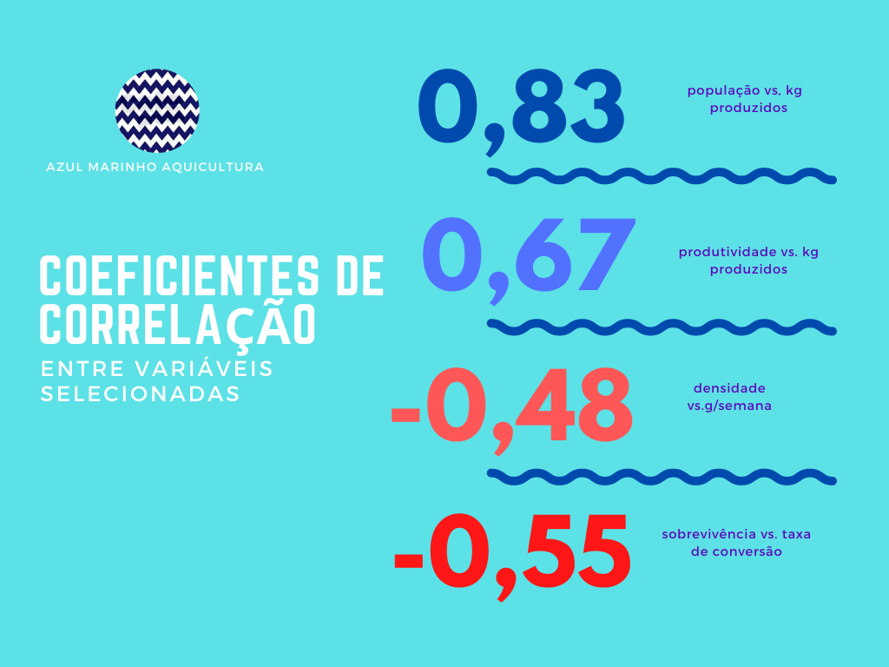

```{r setup, include=FALSE}
knitr::opts_chunk$set(
  echo = FALSE,
  knitr.table.format = "html"
  )
```


```{r, include=FALSE}

library(tidyverse)
library(googlesheets4)
library(ggthemes)
library(lubridate)
library(ggrepel)
library(scales)
library(corrplot)
library(RColorBrewer)


Biom <- read_sheet("1KkLM7bz-Az-etHUeENou-BjX4mDUfJCccwcCIo0k0CU", 2)

```

```{r, include=FALSE}
Biom$viveiro = factor(Biom$viveiro)
Biom$viveiro = factor(Biom$ciclo)
library(RColorBrewer)


Biom_numeric <- Biom %>%
  rename(harverst_kg = "biom_real", ind_per_sqm = "densidade",
         survival = "sobrevive", fcr = "tca", population="pop",
         kg_per_ha = "produtividade", end_g = "g_final",
         start_g = "biometria_1", doc = "ddc", g_wk = "g_semana") %>% 
        na.omit() %>%
        select(population, harverst_kg, survival,
         ind_per_sqm, kg_per_ha,end_g, start_g, doc, fcr,g_wk)

Biom_numeric


```


Inúmeras variáveis estão presentes em sistemas aquáticos, e viveiros para produção aquícola não fogem à esta regra. No nosso caso trataremos de produção de camarão marinho. Selecionamos algumas variáveis com maior impacto sobre a rentabilidade do cultivo e apresentamos o grau de  correlação entre elas. O objetivo é de determinar seu grau de associação (negativa, positiva ou mesmo nenhuma), implicando ou não em casualidade entre elas. A idéia é encorajar análises e decisões com base em dados que devem estar disponíves em um empreendimento minimamente organizado. 

Sabemos que nem sempre correlação implica em uma relação causa-efeito. Significância estatística e a importância prática do que occorre no dia a dia são coisas diferentes. Na ausência de um tratamento estatístico mais rigoroso, fica por conta da experiência e do bom senso do produtor estabelecer uma diferença mais clara quando há, simplesmente, uma correlação e quando ocorre, de fato, causa e efeito. Poderemos assim assegurar tomadas de decisões mais acertadas. 

Pode ocorrer que haja significância estatística para um coeficiente de correlação, quando, em realidade, esta correlação nem exista. São as chamadas correlações espúrias, ou seja a correlação ocorre devido a uma terceira variável que não foi levada em conta. Pode haver correlação sem qua haja causa. A correlação é apaenas uma indicação que as variáveis andam juntas de um certo modo.

Os coeficientes apresentados apenas mostram a proximidade dos pontos a uma linha reta, sem contudo defininir a inclinação desta linha. A utilidade das correlações está no fato de que é possível prever o valor de uma variável através da observação ou  modificação de outra.

Os dados apresentados são resultado de 107 cultivos em diversos viveiros, realizados entre os anos de 2015 e 2021. Os viveiros foram povoados, em sua maioria, com 12 camarões/m^2^, possuem área máxima de 4,00 ha e não houve utilização de aeração suplementar.

Para obtenção da matriz de correlação, separamos as seguintes variáveis:

|Variável|Definição|
|:------   |:--------|
|end_g    |Peso final na despesca (g)|
|fcr    |Taxa de conversão alimentar|
|g_wk|Crescimento semanal (g)|
|harverst_kg    |Total produzido (kg)|
|ind_per_sqm    |Camarões/m^2^|
|population   |Camarões povoados (número)|
|start_g    |Peso na primeira biometria (g)
|survival   |Sobrevivência (%)|
|doc    |Dias de cultivo|

O correlograma abaixo mostra de forma gráfica a matriz de correlção entre estas variáveis. Além de exibir os coeficientes de correlação o tamanho dos círculos reprentam a grandeza destes e os codifica em uma gradação de cores os mais negativos em vermelho e os mais positivos em azul.

```{r}
cor(Biom_numeric[, 1:10]) %>%
  corrplot(method = "circle",
           type = "lower",
           order = "alphabet",
           diag = FALSE,
           addCoef.col = 'black',
           tl.col = "blue",
           tl.srt = 45,
           tl.cex = 0.8,
           number.cex = 0.7,
           addgrid.col = "black",
           title = "Matrix de Correlação \nde Produção de Camarão Marinho",
           mar=c(0,0,5,0),
           #col = COL2('PiYG')),
           #col = COL2('PuOr', 10)),
           #col = COL1('YlGn'),
           #col = brewer.pal(n=8, name="Paired"),
           col = brewer.pal(n=8, name="RdYlBu"))
```
É possível observar que as correlações ocorrem de acordo com o que se esperaria delas. Evidente que não é possivel um generalizar para cultivos que sigam diferentes protocolos de operação. Valeria a pena avaliar fazendas com diferentes tamanhos de vivieiros, utilização de aeração e probióticos, bem como com densidades de estocagem mais elevadas. 

As correlações positivas mais fortes foram entre: 

  - nível de povoamento e kg produzidos.
  - produção e produtividade.
  - densidade de estocagem e produtividade.
  - tempo de cultivo e produtividade.
  - sobrevivência e produtividade.
  
  Já as correlações  mais negativas foram menos intensas:

  - sobrevivência e taxa de conversão alimentar. 
  - crescimento semanal e densidade de estocagem, 
  - sobrevivência e crescimento semanal.

As correlações mais próximas a zero, ou seja, sem correlação foram entre taxa de converão e peso final (g) e nível de povoamento e sobrevivência. As demais, podem ser aferidas diretamente da figura acima.


```{r, include=FALSE}

## Pallet Brewer

cor(Biom_numeric[, 1:9]) %>%
  corrplot(method = "color",
           type = "lower",
           order = "alphabet",
           diag = FALSE,
           addCoef.col = 'black',
           tl.col = "blue",
           tl.cex = 0.9,
           tl.srt = 45,
           number.cex = 0.9,
           addgrid.col = "black",
           title = "Matrix de Correlação \nde Produção de Camarão Marinho",
           mar=c(0,0,5,0),
           #col = COL2('PiYG')),
           #col = COL2('PuOr', 10)),
           #col = COL1('YlGn'),
           #col = brewer.pal(n=8, name="Paired"),
           col = brewer.pal(n=8, name = "Paired"))


cor(Biom_numeric[, 1:9]) %>%
  corrplot(method = "color",
           type = "lower",
           order = "alphabet",
           diag = FALSE,
           addCoef.col = 'black',
           tl.col = "blue",
           tl.srt = 45,
           number.cex = 0.9,
           addgrid.col = "black",
           title = "Matrix de Correlação \nde Produção de Camarão Marinho",
           mar=c(0,0,5,0),
           #col = COL2('PiYG')),
           #col = COL2('PuOr', 10)),
           #col = COL1('YlGn'),
           #col = brewer.pal(n=8, name="Paired"),
           col = brewer.pal(n=8, name="RdYlBu"))


### Utilizado a pallet Viridis

library(viridisLite)

cor(Biom_numeric[, 1:9]) %>%
  corrplot(method = "color",
           type = "upper",
           order = "alphabet",
           diag = FALSE,
           addCoef.col = " steelblue",
           tl.col = "blue",
           tl.cex = 0.8,
           tl.srt = 45,
           title = "Matrix de Correlação \nde Produção de Camarão Marinho",
           #col = COL2('PiYG')),
           #col = COL2('PuOr', 10)),
           #col = COL1('YlGn'),
           #col = brewer.pal(n=8, name="Paired"),
           col = magma(10))

```


```{r, include=FALSE}
library(knitr)

## Matiz de correlação

cor_matrix <- Biom_numeric %>% 
  na.omit() %>% 
  select(population, harverst_kg, survival,
         ind_per_sqm, kg_per_ha,end_g, start_g, doc, fcr,g_wk) %>% 
  cor()

kable(cor_matrix, 
      caption = "Matriz de Correlação",
      digits = 4,
      format.args = list(decimal.mark = ","))
```


```{r, include=FALSE}
## Regressão

fit_Biom <- lm(biom_real ~ biom_calc + pop + ddc + densidade + baixa_mil, data = Biom)
summary(fit_Biom)
```




